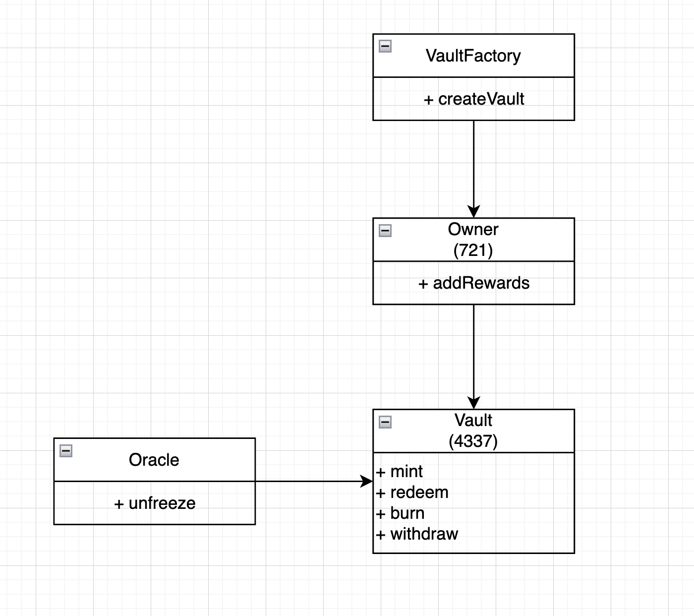

# Merit Contracts

## Data Encoding

Payment data is encoded using standard Ethereum ABI encoding rules for the following tuple structure:

`(uint8 version, uint8 paymentType, bytes32 snapshotId, bytes32 repoId)`

- **`version` (uint8):** The encoding version number. Currently `0x01`.
- **`paymentType` (uint8):** Indicates the type of payment.
  - `0x00`: Solo Payment
  - `0x01`: Repo Payment
- **`snapshotId` (bytes32):** A unique identifier for the payment snapshot.
- **`repoId` (bytes32):** A unique identifier for the repository associated with the payment.
  - **Note:** If `paymentType` is `0x00` (Solo Payment), the `repoId` field is not relevant and can be ignored by the consumer or set to a default value (e.g., `bytes32(0)`) by the producer.

**Note on ABI Encoding:** According to standard ABI encoding rules for static types within a tuple, each element is padded to occupy 32 bytes. Therefore:

- The `uint8 version` is encoded as a 32-byte word.
- The `uint8 paymentType` is encoded as a 32-byte word.
- The `bytes32 snapshotId` occupies 32 bytes.
- The `bytes32 repoId` occupies 32 bytes.

The total length of the ABI-encoded data is **128 bytes**.

## Payments

- claim (Merkle Tree)
- split
- stream (Superfluid)

## Definitions

1. `PR` (Pull Request):

   Set of `(address, score)`

2. `PRs` (List of Pull Requests)

   Ordered List of PRs `[PR_1, PR_2, PR_3, … ]`

3. `CT` (Cap Table)

   Mapping from `address` => `score`

4. `F` State Update Function

   New `CT'` = `F(CT, PRs)`

5. `Claim` is the set of `(address, amount, last_update, unlocked)`

### Ownership

Ownership is represented by one NFT.

- can update `CT`
- can init and adjust the reward mechansim

### CT Initialization

`CT` is seeded by Owner.

### CT Update

Additive: Add `PR` score to `CT` entry.

Weight newer PRs more: `score'` = `score` + `newScore` \* `W(timeSinceUpdate)`

`W(timeSinceUpdate)` = `1 / timeSinceUpdate`

### Claiming

1. Time Based

Rewards are distributed relative to the current `CT` after a fixed period of time.
For example If I own 20% of the `CT` and $100 are distributed for this time window I get $20.

#### Merkle Root Update

For every state update a new Merkle Root with the updated rewards to claim is posted on-chain. These rewards can be unlocked or locked.

For every unlock, a new merkle root is posted on-chain.

If rewards are not claimed after time X they can be claimed by the owner.

### Wallet Abstraction

You need to map every user on GitHub for that repo to an Ethereum Address.

## 4626

- `CT` is represented by share tokens.
- If I own 100 shares and there are 500 shares in total I "own" 20% of the project.
- For new `PR` new share tokens are minted according to the `PR` score.
- How new shares are minted can be anything that gives a higher value to most recent `PRs`
- The contract would loop over a list of `PRs` and mints new shares accordingly.
- Old contributors are diluted.
- You can burn your shares to get the underlying rewards.
- Some shares are frozen waiting for tax clearance etc.
- Tax clearance is pushed through an oracle.
- This allows for "instant" liquidity.
- To avoid a "bank run" where everyone redeems their share tokens immediately it make sense to freeze redemeptions in the beginning and only enable it for specific time intervals.
- Another approach would be to add a lockup for newly minted shares. So people can not "dump" it immediately.
- Timelimit on redemptions. After timelimit owner can get the funds.

